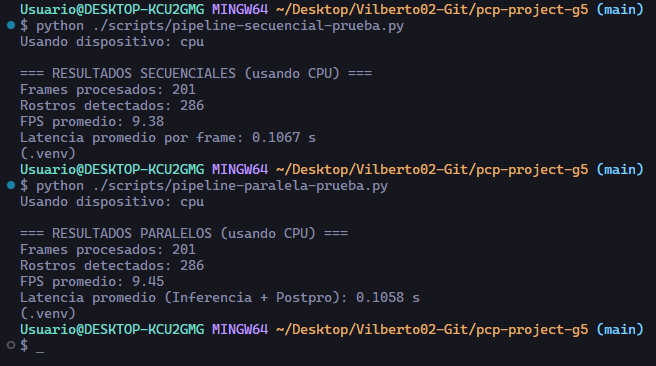

### Medir ganancia

Se realizo la comparación en el rendimiento del pipeline secuencial contra el pipeline con el preprocesamiento paralelizado en la CPU.

**Metodología:**
- **Baseline:** Se ejecutó el script `pipeline-secuencia-prueba.py`, que realiza todas las operaciones (lectura, preprocesamiento, inferencia, postprocesamiento) en un único proceso.
- **Versión Paralela (Preprocesamiento):** Se ejecutó el script `pipeline-paralelo-prueba.py`, que utiliza un proceso "worker" dedicado en la CPU para realizar las tareas de **lectura de frames y preprocesamiento (`resize`)**, mientras el proceso principal se encarga de la inferencia y el postprocesamiento.

**Resultados Obtenidos:**
Prueba de la paralelización del preprocesamiento

**Cálculo del Speedup:**

- **Speedup = FPS_Paralelo / FPS_Baseline**
- **Speedup =** `9.45 / 9.38` **= 1.0075x**

**Conclusión:**

La paralelización de la etapa de preparación de datos en la CPU resultó en una **mejora de rendimiento pequeña de 1.0075x**, lo que indica que no hubo una aceleración significativa.
Este resultado demuestra que, en un pipeline que se ejecuta completamente en CPU, **el cuello de botella principal no es la etapa de lectura y preprocesamiento, sino la etapa de inferencia del modelo YOLO**. La operación de inferencia es tan computacionalmente intensiva en la CPU que el proceso principal pasa la mayor parte de su tiempo en esa tarea. Aunque el proceso worker prepara los frames de forma concurrente, debe esperar a que el proceso principal termine la inferencia antes de poder entregarle el siguiente frame.
El "overhead" (costo computacional de crear y gestionar procesos y colas) es casi tan grande como el tiempo ahorrado.